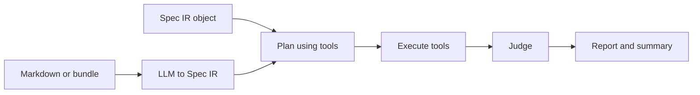

```text
  / __|  | || |   | __|   / __|  | |/ /   |_ _|   | _ \     o O O  /   \   |_ _|
 | (__   | __ |   | _|   | (__   | ' <     | |    |   /    o       | - |    | |
  \___|  |_||_|   |___|   \___|  |_|\_\   |___|   |_|_\   TS__[O]  |_|_|   |___|
_|"""""|_|"""""|_|"""""|_|"""""|_|"""""|_|"""""|_|"""""| {======|_|"""""|_|"""""|
"`-0-0-'"`-0-0-'"`-0-0-'"`-0-0-'"`-0-0-'"`-0-0-'"`-0-0-'./o--000'"`-0-0-'"`-0-0-'
```

> **Local LLMs + MCP-backed tools** to parse specs, plan probes, collect evidence and return requirement-level verdicts—without paying cloud token or request costs for every verification pass.

**Checkir AI** is a spec-driven verification runtime: it reads a human-readable spec, plans probes, runs tools (including MCP-backed capabilities) and returns **requirement-level verdicts** — pass, fail, inconclusive, or blocked — with evidence you can inspect offline. The default LLM stack is **Ollama** on your machine; tool hosts connect over **MCP** the same way Cursor talks to other servers.

---

## Why?

- **Tokens and API calls add up.** Re-running the same “does the UI match the spec?” loop through a cloud model is slow and expensive.
- **Local-first verification** keeps sensitive URLs, traces, and artifacts on your machine while still using an LLM where judgment helps (planning, interpretation).
- **Repeatable runs** write structured reports, SQLite state and artifacts under a known output root—ideal for CI, dashboards and agent loops.
- **CLI and MCP as the integration surface** lets Cursor, Claude Code and other hosts treat verification as a first-class tool alongside Chrome DevTools, filesystem, etc.

---

## Use cases

- **Agent implement → verify → fix:** After a coding agent changes an app, call `verify` (or the MCP `verify_spec` tool) and feed failures back into the next edit.
- **Human acceptance checks:** Maintain a markdown spec next to the repo; run verification before merge or release.
- **Exploratory “what would we test?”:** Use `suggest_probe_plan` over MCP to plan probes without executing a full run.
- **Local model hygiene:** Use `ollama status`, `model list`, `model suggest`, and `model pull` so the right instruct/tool-capable model is available before a run.
- **Chrome DevTools MCP wiring:** Use `chrome-devtools list-tools` / `self-check` to confirm your MCP server exposes the expected tool surface (see `checkirai.config.json` for project defaults).

---

## Requirements

- **Node.js** 22 or newer (`engines` in `package.json`)
- **pnpm** (recommended; scripts assume it)
- **Ollama** (optional but default for LLM-assisted phases) — install separately and start the daemon
- **Playwright browsers** if you enable `playwright-mcp` in `--tools` (`pnpm exec playwright install` as needed)

---

## Installation

### 1. Clone and install dependencies

```bash
git clone <repository-url>
cd localtest   # or your clone directory name
pnpm install
```

`postinstall` runs a TypeScript build so the `checkirai` bin can load `dist/`.

### 2. Make the CLI available globally (pick one)

From the repo root:

```bash
pnpm link --global
```

Or install this package globally:

```bash
pnpm add -g .
```

Confirm the binary is on your `PATH` (pnpm’s global bin):

```bash
pnpm bin -g
checkirai --help
```

**Note:** The published entrypoint is `bin/checkirai.js` and delegates to `dist/`. If you see a build error, run `pnpm build` manually.

### 3. Optional project config

Copy or edit `checkirai.config.json` in your project root for defaults (target URL, tools, Ollama host/model, and MCP server definitions such as `chrome-devtools`).

---

## Web dashboard

The repo ships a **local web UI** plus a small API so you can kick off runs, watch progress, and browse results without living only in the terminal.

| Mode                        | Command          | Notes                                                                        |
| --------------------------- | ---------------- | ---------------------------------------------------------------------------- |
| Development (API + Vite UI) | `pnpm web:dev`   | UI: `http://127.0.0.1:5173` · API health: `http://127.0.0.1:8787/api/health` |
| Production build            | `pnpm web:build` | Builds TypeScript + Vite static assets                                       |
| Production serve            | `pnpm web:start` | Serves built UI + API (`SERVE_STATIC_FROM=web/dist`)                         |

For day-to-day work, `pnpm web:dev` is the usual choice.

---

## CLI commands

Top-level program: **`checkirai`** (aliases in `package.json`: `spec-driven-verifier`, `verify-app` → same binary).

### `checkirai verify`

Verify a target URL against a markdown spec (or restart from a previous run).

| Option                                       | Description                                                                                         |
| -------------------------------------------- | --------------------------------------------------------------------------------------------------- |
| `--spec <path>`                              | Path to spec markdown (required unless restarting from `spec_ir` / `llm_plan` with `--restart-run`) |
| `--target <url>`                             | Base URL of the app under test (**required**)                                                       |
| `--tools <list>`                             | Comma-separated: `playwright-mcp`, `shell`, `fs`, `http`, `chrome-devtools` (default `fs,http`)     |
| `--out <dir>`                                | Output root (default `.verifier`)                                                                   |
| `--policy <name>`                            | `read_only` or `ui_only`                                                                            |
| `--llm-provider <p>`                         | `ollama`, `remote`, or `none` (default `ollama`)                                                    |
| `--ollama-host <url>`                        | Default `http://127.0.0.1:11434`                                                                    |
| `--ollama-model <name>`                      | Model name or `auto`                                                                                |
| `--allow-auto-pull` / `--no-allow-auto-pull` | Allow pulling missing Ollama models                                                                 |
| `--restart-from <phase>`                     | `start` · `spec_ir` · `llm_plan`                                                                    |
| `--restart-run <runId>`                      | Parent run UUID when restarting                                                                     |

**Exit codes:** `0` pass · `1` fail · `2` inconclusive · `3` blocked.

### `checkirai ollama status`

Check that Ollama is reachable.

| Option         | Default                  |
| -------------- | ------------------------ |
| `--host <url>` | `http://127.0.0.1:11434` |

### `checkirai model list`

List installed Ollama models.

| Option         | Default                  |
| -------------- | ------------------------ |
| `--host <url>` | `http://127.0.0.1:11434` |

### `checkirai model suggest`

Print recommended models (structured / tool-friendly output).

| Option                       | Default                                    |
| ---------------------------- | ------------------------------------------ |
| `--tooling` / `--no-tooling` | Prefer tooling-capable models (default on) |

### `checkirai model pull <modelName>`

Download a model via Ollama’s HTTP API (e.g. `llama3.1:8b-instruct`).

| Option         | Default                  |
| -------------- | ------------------------ |
| `--host <url>` | `http://127.0.0.1:11434` |

### `checkirai chrome-devtools list-tools`

Spawn a Chrome DevTools MCP server process and log the tools it exposes.

| Option            | Description                                        |
| ----------------- | -------------------------------------------------- |
| `--command <cmd>` | **Required** — executable to launch the MCP server |
| `--args <args>`   | Space-separated arguments (optional)               |
| `--cwd <cwd>`     | Working directory (default: current directory)     |

### `checkirai chrome-devtools self-check`

Verify the Chrome DevTools MCP server exposes the expected tool surface.

| Option            | Description  |
| ----------------- | ------------ |
| `--command <cmd>` | **Required** |
| `--args <args>`   | Optional     |
| `--cwd <cwd>`     | Optional     |

---

## MCP server and Cursor

Checkir AI exposes an **MCP server** (stdio) so editors and agents can call verification as tools instead of shelling out.

- **Implementation:** `src/interfaces/mcp/server.ts` (`startMcpServer()`)
- **Tools:** verification (`verify_spec`, `suggest_probe_plan`, `list_capabilities`), run inspection (`get_report`, `get_run_graph`, `get_artifact`, `explain_failure`), and Ollama helpers (`ollama_status`, `model_list`, `model_suggest`, `model_pull`, `model_ensure`)

Start the server locally (stdio):

```bash
pnpm mcp
```

Optional: set `CHECKIRAI_OUT` to override the verifier output root (default `.verifier`).

**Cursor:** register the MCP server with `pnpm mcp` as the command and this repo as `cwd`—see **[docs/USAGE.md](docs/USAGE.md)** for a ready-made JSON snippet and `verify_spec` examples.

For end-to-end examples, probe output layout, and integration notes, **`docs/USAGE.md`** is the detailed guide.

---

## Development scripts

| Script                            | Purpose                       |
| --------------------------------- | ----------------------------- |
| `pnpm build`                      | Compile TypeScript to `dist/` |
| `pnpm dev`                        | Run CLI via tsx (`--help`)    |
| `pnpm typecheck`                  | `tsc --noEmit`                |
| `pnpm test`                       | Vitest                        |
| `pnpm lint` / `pnpm lint:fix`     | Biome                         |
| `pnpm format` / `pnpm format:fix` | Biome formatter               |
| `pnpm mcp`                        | MCP server (stdio)            |

---

## Architecture overview

End-to-end, a run is a **pipeline** from natural-language intent to a frozen result. The local LLM is used where structure and judgment are needed; deterministic code handles orchestration, policies, and parts of scoring.

1. **Spec in** — Markdown file, **Spec bundle** (inline markdown + URLs + files resolved to text), or a pre-built **Spec IR** object.
2. **Normalize → Spec IR** — A local LLM turns prose into a structured intermediate representation: requirements, observables, and metadata the rest of the system consumes. Outputs are **persisted** (e.g. `spec_ir` artifacts) so a run is auditable and replayable.
3. **Plan → test plan** — The planner consults the **capability graph** for your `--tools` set (HTTP, filesystem, shell, Playwright / Chrome DevTools MCP, …). A local LLM (and/or procedural planners) produces executable steps or probes aligned with those tools—not a generic script ignoring what is actually available.
4. **Execute** — Tool calls run against the **target URL** under the chosen **policy** (e.g. read-only vs UI-oriented). Evidence lands in the artifact store and DB.
5. **Judge & synthesize** — **Deterministic checks** and **LLM judges** assign per-requirement verdicts (`pass` / `fail` / `inconclusive` / `blocked`), then the runtime emits `report.json`, `summary.md`, and related rows for the dashboard and MCP tools.



### Starting from a checkpoint (“phases”)

You do **not** have to redo every expensive step. A parent run stores artifacts; a child run can **restart from a saved phase** by passing **`--restart-run`** with the parent’s run id and **`--restart-from`**:

| `--restart-from` | Meaning                                                                                                                                                                                                                                                                                              |
| ---------------- | ---------------------------------------------------------------------------------------------------------------------------------------------------------------------------------------------------------------------------------------------------------------------------------------------------- |
| **`start`**      | Full pipeline from spec input (default).                                                                                                                                                                                                                                                             |
| **`spec_ir`**    | Reuse the parent’s **frozen Spec IR**—skip normalization LLM work; continue with planning and later stages.                                                                                                                                                                                          |
| **`llm_plan`**   | Reuse the parent’s **saved test-plan artifact**—skip normalization and the main planning phase; continue with execution and judgement. Requires the same kind of setup as a full **Chrome DevTools + LLM** generic loop (e.g. `chrome-devtools` in `--tools` and an LLM provider other than `none`). |

The same **`restartFromPhase` / `restartFromRunId`** fields exist on **`verify_spec`** over MCP and on the web API. Pick the phase that matches how much of the parent run you want to reuse when iterating on plans, tooling, or judges.

---

## Status and contributing

This project is **work in progress**: behavior and APIs evolve **almost daily** as probes, judges and MCP integrations mature. If something is rough or undocumented, that is expected for now.

**Contributions are welcome** — issues, specs, probe ideas, and PRs that tighten verification or docs all help. For deeper context on the current MVP scope (including known limitations) read **[docs/USAGE.md](docs/USAGE.md)**.
